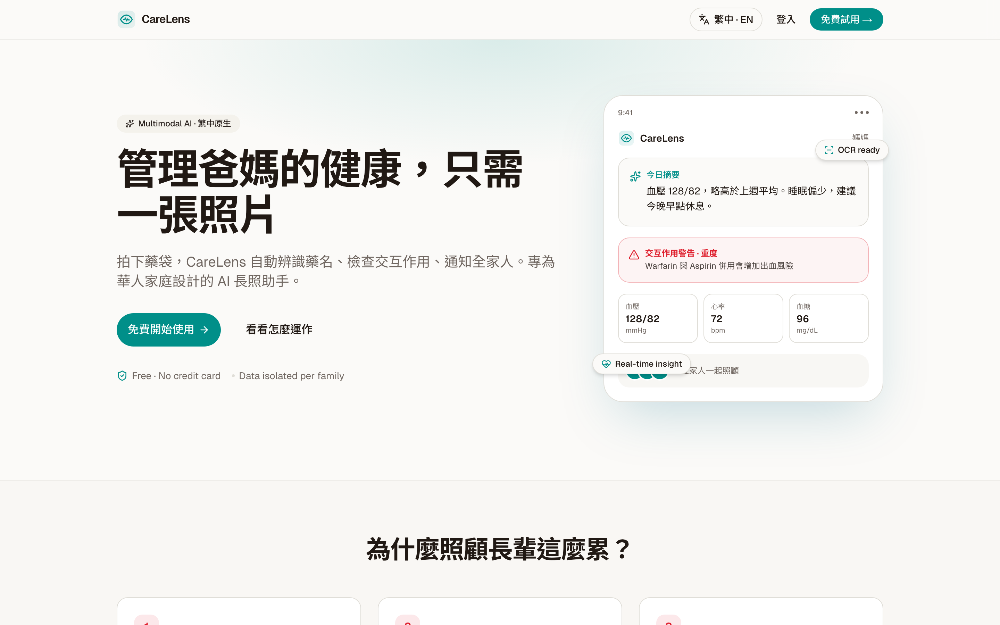
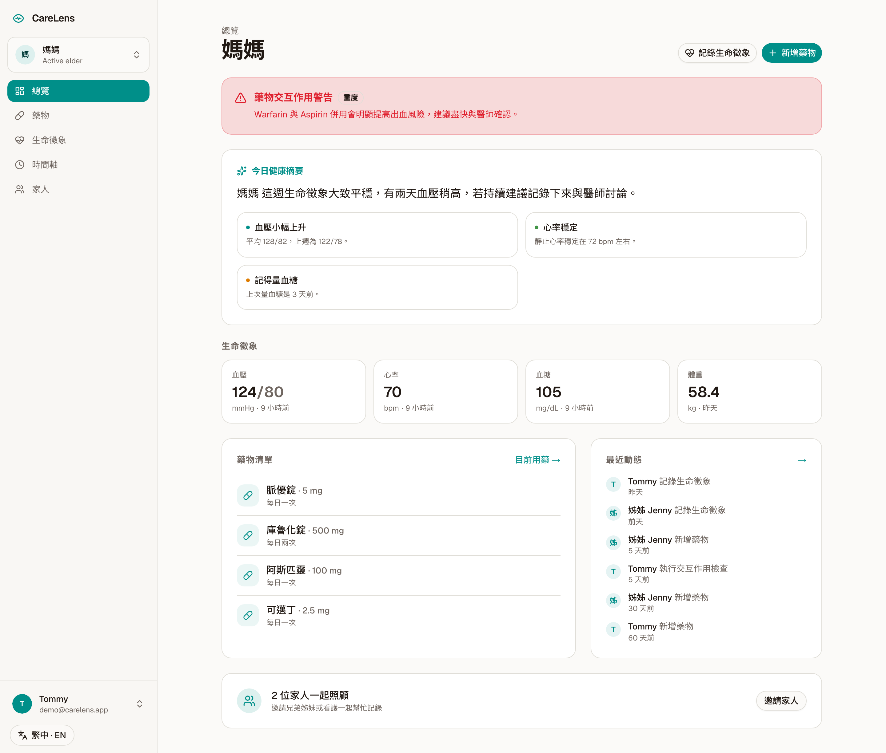
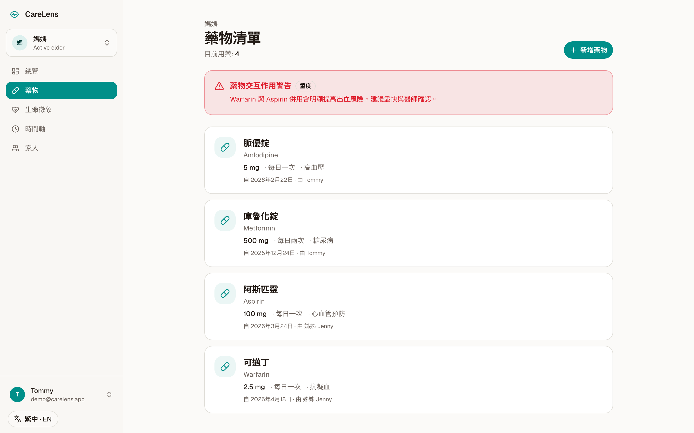
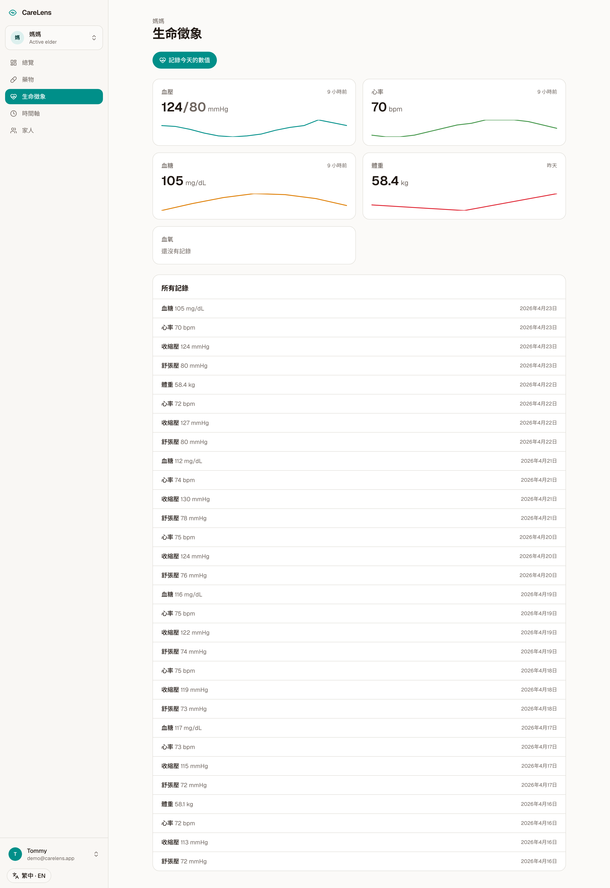
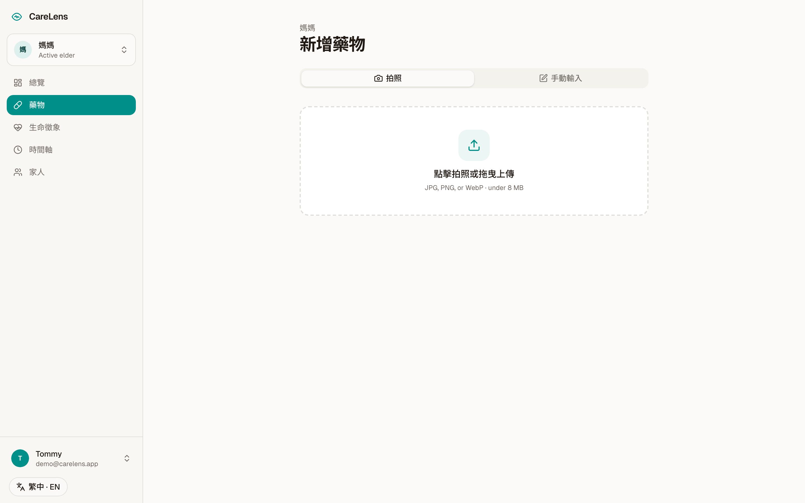
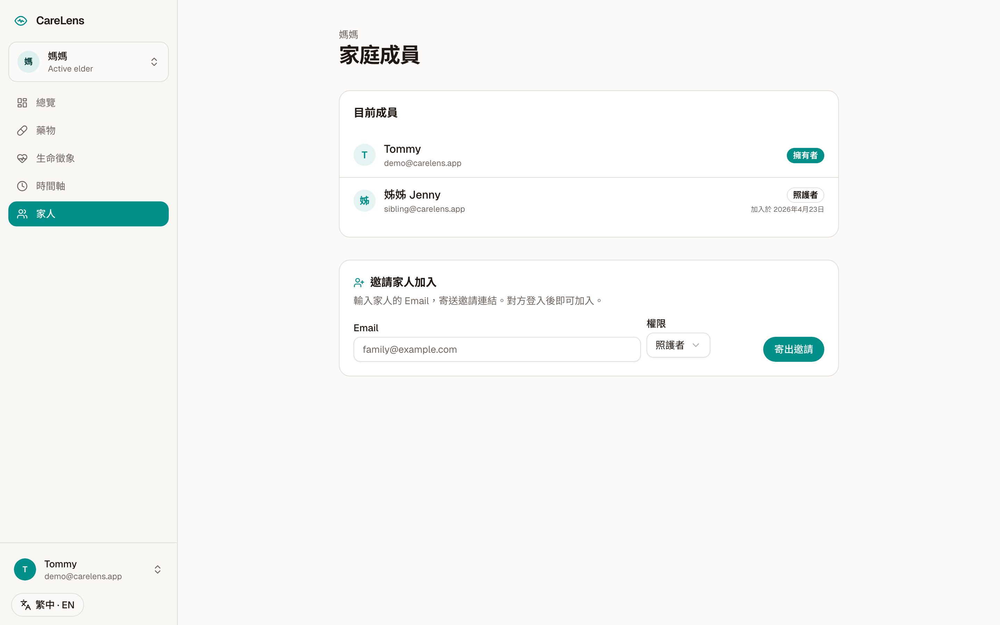
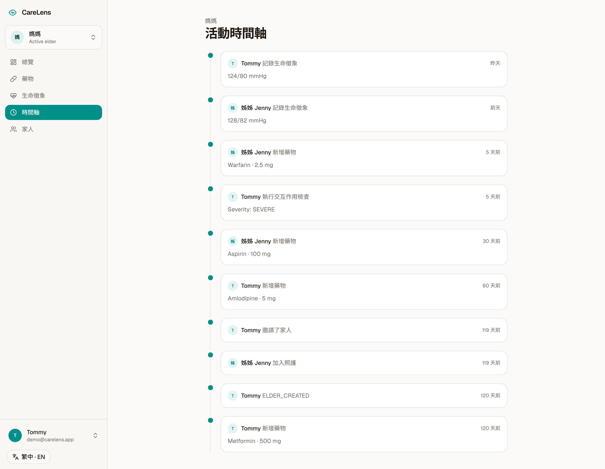

# CareLens

> Bilingual (繁中 / English) AI caregiving copilot for families looking after aging parents.
> Snap a photo of a pill bottle — CareLens reads the drug, checks for dangerous interactions, and keeps the whole family in sync.




---

## Screenshots

| Dashboard | Medications |
|-----------|-------------|
|  |  |
| **Vitals** | **Add medication (OCR flow)** |
|  |  |
| **Family & roles** | **Activity timeline** |
|  |  |

---

## Why CareLens

Adult children caring for aging parents face three compounding pains:

1. **Information is scattered.** Medication lists on paper, vitals in a notebook, appointments in a group chat — nobody sees the whole picture.
2. **Medical literacy is missing.** Handwritten prescriptions, confusing drug combinations, unclear side-effects.
3. **Siblings fall out of sync.** The one who lives closest sees the doctor; the one who lives abroad relies on phone calls.

Existing tools are either marketplace apps for hiring caregivers (CareLinx, Honor), single-user pill reminders (Medisafe), or clinician EHR. **Nothing treats the family as the unit of care, uses multimodal AI to remove the literacy barrier, and is designed Traditional-Chinese-first for Chinese-speaking households.**

## What it does (MVP, all shipping)

- **Photo-to-medication in 3 seconds.** Point phone at a pill bottle or prescription slip → Claude Vision extracts drug name (ZH + EN), dose, frequency, warnings. Confidence-graded so the family knows when to verify.
- **Drug interaction check with severity grading.** Every new medication is automatically cross-checked against the existing list. Severity: NONE / MILD / MODERATE / SEVERE / CRITICAL. Families see the warning before the next doctor visit.
- **Proactive daily insight.** The dashboard shows an AI-written summary ("血壓 128/82，比上週高，睡眠偏少可能有關") instead of making the caregiver stare at charts.
- **Family sharing with roles.** Invite siblings or professional carers as `CAREGIVER` (read + write) or `VIEWER` (read-only). The owner controls access. Activity timeline shows who did what when.
- **Vital signs with trend sparklines.** BP, HR, glucose, weight, SpO₂ — log in seconds, see 7-day trends at a glance.
- **繁中-first UI, English toggle.** Every string translated, including AI-generated summaries. Noto Sans TC bundled so typography looks deliberate.
- **Mobile-first responsive.** Phone is the primary surface; desktop isn't an afterthought.

## Try it

### Hosted demo

Visit the deployed URL (see top of repo) and click **"Try with demo account"** on the sign-in page — you'll log in instantly to a pre-seeded household ("媽媽", 4 medications including a deliberate Warfarin+Aspirin interaction, 14 days of vitals, 10 activity events, 1 sibling co-caregiver).

### Run locally

```bash
pnpm install
pnpm db:migrate     # creates prisma/carelens.db
pnpm db:seed        # populates demo account with realistic data
pnpm dev
```

Open [http://localhost:3000](http://localhost:3000). Click **"Try with demo account"** on `/auth`.

Optional: add `ANTHROPIC_API_KEY` to `.env` to run real Claude Vision OCR and interaction analysis. Without a key, the app uses deterministic mock responses so the full UX is demoable offline.

## Architecture

- **Next.js 16** App Router, server components, server actions — no separate backend.
- **Prisma 7 + SQLite** locally (portable, zero-config). Swap to Postgres/Supabase for production by changing `DATABASE_URL` and re-running migrations.
- **Claude Sonnet 4.5** via Anthropic SDK for OCR (multimodal), interaction analysis, and daily insights. All prompts return strict JSON validated by Zod.
- **Tailwind v4 + shadcn/ui (Radix)** — warm off-white + teal palette, OKLCH color space, 4.5:1+ contrast throughout.
- **Session-based auth** — bcrypt + httpOnly cookies, Session table in DB. Stays portable across hosts (no third-party identity provider required).
- **i18n** — custom lightweight layer with typed message maps. No bundle bloat.

### Data model highlights

- `Elder` is the unit of care. `FamilyMember` is a user-elder-role join table with three roles.
- `Interaction` is an AI-generated artifact — cached so we don't re-run Claude on every page load, re-computed when meds change.
- `ActivityLog` is append-only, powering the family timeline and acting as an audit trail.
- All write paths go through server actions that re-check role via `requireElderAccess` → `canWrite`. No direct DB access from the client.

## Project structure

```
carelens/
├── prisma/
│   ├── schema.prisma       # User, Elder, Medication, Vital, Interaction, Insight, FamilyMember, ActivityLog
│   └── seed.ts             # Realistic demo household
├── src/
│   ├── app/
│   │   ├── page.tsx        # Landing (繁中-first, bilingual)
│   │   ├── auth/           # Sign-in / sign-up + demo login
│   │   ├── app/            # Authenticated app shell
│   │   │   ├── onboarding/ # First-elder wizard
│   │   │   └── elders/[elderId]/
│   │   │       ├── page.tsx           # Dashboard
│   │   │       ├── medications/       # List + OCR new flow
│   │   │       ├── vitals/            # Log + trend sparklines
│   │   │       ├── timeline/          # Activity feed
│   │   │       └── family/            # Invite + role management
│   │   ├── invite/[token]/ # Accept-invite flow
│   │   ├── actions/        # Server actions (auth, elders, meds, vitals, family)
│   │   └── api/ocr/        # Claude Vision endpoint
│   ├── components/ui/      # shadcn components
│   └── lib/
│       ├── db.ts           # Prisma + better-sqlite3 adapter
│       ├── auth.ts         # Session creation / retrieval
│       ├── claude.ts       # Anthropic SDK wrappers w/ mock fallbacks
│       ├── elders.ts       # Access control helpers
│       ├── i18n.ts         # zh-TW + en-US message maps
│       └── locale.ts       # Cookie-based locale persistence
└── docs/
    ├── PRD.md              # Product requirements, scope, risks
    ├── ARCHITECTURE.md     # Technical design, RLS, AI flows
    └── DESIGN.md           # Design tokens, IA, wireframe notes
```

## Commands

```bash
pnpm dev          # dev server
pnpm build        # production build
pnpm start        # run production build
pnpm lint         # ESLint
pnpm db:migrate   # run Prisma migrations
pnpm db:seed      # re-seed demo data
pnpm db:studio    # open Prisma Studio
```

## Production deployment notes

The current repo ships with SQLite for portability and zero-config local dev. For production on Vercel:

1. Provision a Postgres instance (Neon, Supabase, or Vercel Postgres).
2. Change `schema.prisma` datasource provider to `postgresql`.
3. Set `DATABASE_URL` in Vercel env vars.
4. Set `ANTHROPIC_API_KEY`.
5. `pnpm prisma migrate deploy` on first boot.

The rest — auth, API routes, UI — works unchanged.

## Roadmap (post-hackathon)

- Native iOS / Android wrapper (PWA install prompt shipped; native wrappers next)
- Apple Health / Google Fit ingestion for automatic vitals
- PDF monthly report for doctor visits
- Clinician-facing read-only portal with QR handoff
- Email notifications for interaction warnings
- Optional on-chain consent receipts (planned for HashKey Chain)

## Safety & disclaimer

CareLens is informational. It is **not** medical advice and does **not** replace professional clinical judgment. Every AI-generated interaction warning and insight card displays a persistent disclaimer. The app never recommends stopping a prescribed medication — it always defers to the prescribing physician.

## License

MIT — see [LICENSE](./LICENSE).

---

**Built for Chinese-speaking families.** 為華人家庭而做。
